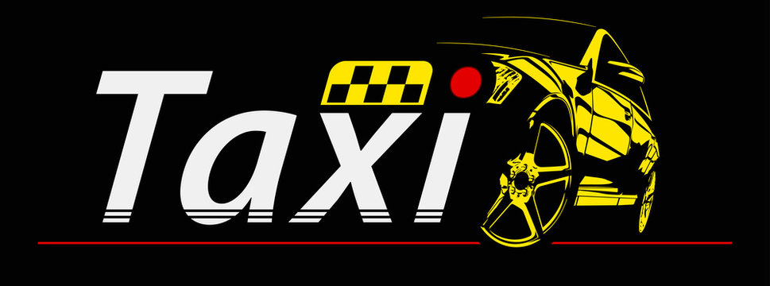

# 🚕 Taxi service 🚕

### Project description:
> This is web-application that represent simple taxi service. 
> The app includes backend and frontend parts, is implemented 
> using n-tier architecture, connected to MySQL database and 
> complies with SOLID standard. The program allows you to perform 
> CRUD operations with the database, as well as to register and 
> authenticate the driver.

### Features: 
> Various CRUD operations such as:
* create/update/delete a car;
* create/update/delete a manufacturer;
* create/update/delete a driver;
* display list of manufacturers/drivers/cars;
* add driver to car / remove driver from car;
> The possibility to register as a driver and then be authenticated in service.
> 
> Provided login and logout

### Structure:
> The project consists of three layers:
* Controller - provides for the processing of user requests;
* DAO - provides a database operation;
* Service - includes all the application logic;

> Relationships in the database:
> 
> 

### Application was built with:
* Java 11;
* HTML, CSS
* JDBC;
* HttpServlet and HttpFilter
* Apache Maven 3.8.6 
* Apache Tomcat 9.0.65;
* MySQL;

### How to launch project:
> It is required to have JDK, MySQL, Apache Maven & Tomcat (v. 9.0.65)
1. Clone this project.
2. You need to create schema in the database, for this you can use sql-script init_db.sql in resources folder.
3. Configure the connection (enter your data in the ConnectionUtil class).
4. Run Tomcat.